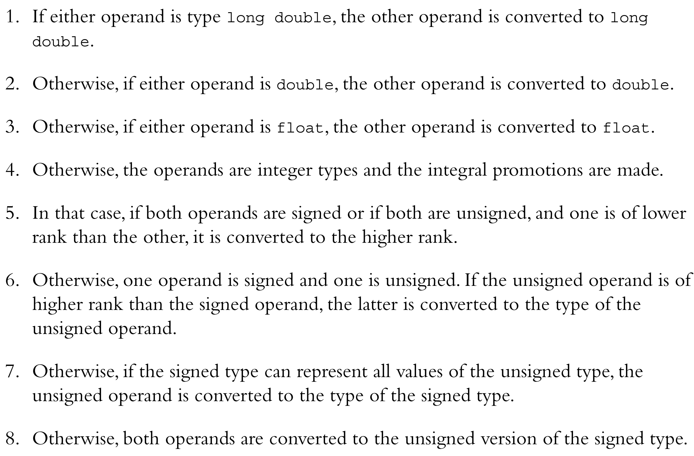

# 基础

## 预处理器

处理`#`开头的指令。

`#include`：包含其他头文件（旧风格`.h`、无后缀风格。\
`#define`：宏定义

## 函数

函数原型声明函数的接口。\
函数定义由函数头、函数体构成。函数体包含了多条语句（表达式+分号）。

入口函数的函数头，旧的C风格为`main()`，实际上返回`int`。\
C++参数为空默认指`void`，C参数为空则是保持沉默。

## 其他

注释方式：`//`, `/* */`

字符集：ASCII、Unicode（universal code name/code point）

## 基础数据类型

存储数据：地址、类型、值\
变量名：由字母、数字、下划线组成。不可以数字开头，最好也不以下划线开头（保留标识符）。C对于变量名称长度有所限制。

### 整数

关键字

`char`(由实现决定是`signed`或者`unsigned`), `short`, `int`, `long`, `long long`

初始化

```cpp
int a = 1;    // 传统c
int a(1);     // c++新增
int a = {1};  // c++新增
int a{1};     // c++11
int a{};
```

常量

10进制常量尽可能使用int, long, long long\
16进制或8进制常量尽可能使用int, unsigned int, long, unsigned long, long long, unsigned long long\
指明数据类型：`L`, `UL`, `LL`, `ULL`
> 字符早期被存储为int，后面才存储为char

wchar_t

```cpp
wchar_t a = L'a';
wcout << L"abc";
```

char16_t, char32_t

```cpp
char16_t = u'a';
char32_t = U'a';
```

### 浮点数

关键字：`float`, `double`, `long double`\
存储格式：IEEE 754

常量\
默认`double`，指明数据类型：`F`, `L`

### 布尔值

关键字：`bool`

### const

* 明确数据类型
* 配合命名空间，限制使用范围
* 可用于复杂数据类型

### 类型转换

* `double`转`float`类，可能丢失有效数字或超出范围
* `long`转`short`类，可能超出范围
* 浮点数类型转整数类型，可能丢失小数或超过范围
* `{}`初始化更为严格，不允许`narrowing`



```cpp
(long)num // c
long(num) // c++ 更像函数调用
```

## 运算符

`/`\
整数相除，小数截断

`%`\
操作数需为整数
